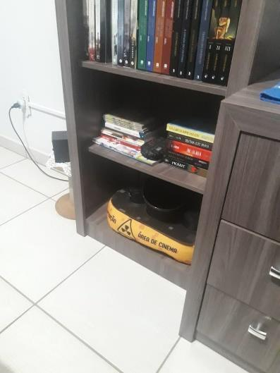
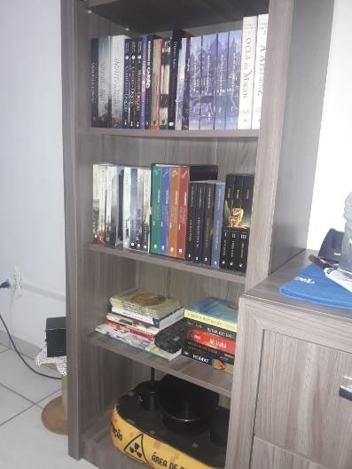
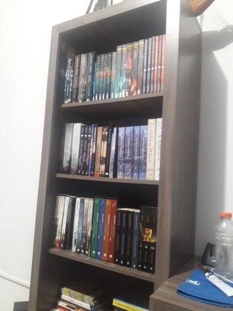
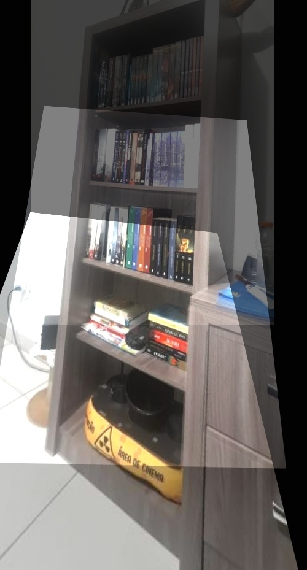

# Image merging with OpenCV(Sift algorithm)

**Necessary to install the following libs:**
```
pip install opencv-python==3.4.2.16
pip install opencv-contrib-python==3.4.2.16
pip install matplotlib
```
Training images: <br>




Image resulting from the algorithm developed with SIFT:<br>

